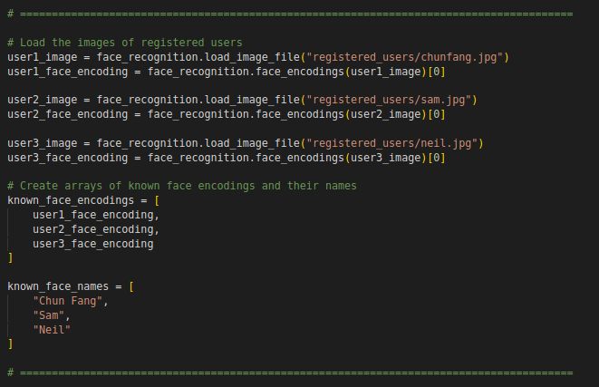

# Smart Security Door
Warm greetings from our Smart Security Door!

## Getting started
1) To implement the smart security door, you need to upload the photos of registered/authorized users under the folder directory `"./scripts/WorkSpace/registered_users"`. You may rename the images with their respective username of your choice.  

2) Then, direct to `./scripts/WorkSpace`, edit codes in face_reg_socket.py and security_door_socket.py to add registered users’ names.  

  
For the example shown above, Chun Fang is registered as **user1**, while Neil is registered as **user2**. They are recognized as authorized users. To register additional authorities, you may amend the list of `known_face_names` and `known_face_encodings` along with their facial images stored in the `/registered_users` folder.  

3) Run the following scripts in separated terminals.  
  
    a) Run the roscore to initiate  
        `roscore`  

    b) Run speech_recognition module  
        `rosrun rchomeedu_speech google_sr.py`  

    c) Run sound play module  
        `rosrun sound_play soundplay_node.py`  
        `rosrun sound_play say.py "Welcome to Smart Security Door!"` (optional)  

    d) Initiate the smart security door program  
        `cd catkin_ws/src/Smart-Security-Door/scripts/`  
        `python security_door_socket.py`  

    e) Run facial recognition module  
        `cd catkin_ws/src/Smart-Security-Door/scripts/WorkSpace`  
        `source test/bin/activate`  
        `python face_reg_socket.py`  

    f) Run the output program  
        `cd catkin_ws/src/Smart-Security-Door/scripts/`  
        `python security_door_output.py`  

4. Congratulations, the system is up running!